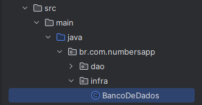

# CRUD Java

---

# Programação Orientada a Objetos II

## Desenvolvimento de um CRUD com Java, IntelliJ IDEA, Maven e PostgreSQL

### Author: Guilherme Silva (guihenriqu4); Date: 14/08/2024

# Sumário

1. [Configuração do Banco de Dados em Ubuntu](#configuração-do-banco-de-dados-em-ubuntu)
2. [Configuração do ambiente de desenvolvimento (Maeven)](#configuração-do-ambiente-de-desenvolvimento-maven)
3. [Configuração de Infraestrutura](#configuração-de-infraestrutura)

---

# Configuração do Banco de Dados em Ubuntu

---

Leva-se em consideração que o PostgreSQL tenha sido instalado pela dependência Maeven. Caso não esteja funcionado, siga o passo a passo de instalação presente em: [Instalação do PostgreSQL no Ubuntu](https://github.com/rogerio-silva/java-crud?tab=readme-ov-file#configura%C3%A7%C3%A3o-do-ambiente-de-desenvolvimento)

---

## Criação do Banco de Dados

Antes de qualquer ação, baixe o arquivo .sql presente neste GitHub e armazene em um local cujo endereço possa ser facilmente lembrado. Após essa instalação, inicie o terminal do Ubuntu e acesse o PostgreSQL através do seguinte comando:

```shell
sudo -i -u postgres
```
Em seguida, acesse a estação de comandos com o seguinte comando:

```shell
psql
```

Finalmente, crie um banco de dados:

```shell
CREATE DATABASE nome_do_banco;
```

Neste momento, é necessário criar um usuário e garantir todos os direitos deste banco de dados a ele.

```shell
CREATE USER nome_do_usuario WITH PASSWORD 'senha';
```

```shell
GRANT ALL PRIVILEGES ON DATABASE nome_do_banco TO nome_do_usuario;
```

Com esta parte pronta, saia da estação de comando usando \q e importe o banco de dados com a seguinte sintaxe sql:

```shell
psql -d nome_do_banco -U nome_do_usuario -f caminho/para/o/arquivo.sql
```

Para verificar se os dados foram importados corretamente, acesse o banco de dados e liste as tabelas:

```shell
psql -d nome_do_banco -U nome_do_usuario
```

```shell
\dt
```

---

# Configuração do ambiente de desenvolvimento (Maven)

## A ferramenta utilizada neste projeto será o IntelliJ IDEA

- Copie o link de cópia desse repositório Git (Aconselhável, nesse momento, utilizar o link http)

  

- Acesse a aba "Get from VCS" da ferrementa IntelliJ IDEA

  

- Cole o link copiado na região de url e selecione o endereço desejado. Por fim, clique em "clone"

  

- Preparações concluídas. Resta agora instalar as dependências Maeven e configurar a infraestrutura.

---

# Configuração de Infraestrutura

- Com o projeto instalado em seu computador, acesse o seguinte endereço src/main/java/br.com.numbersapp/infra/BancoDeDados.java

  

- Em seguida, altere os campos "user" e "password", inserindo o usuário e senha criados na primeira etapa deste documento

  

- encerrado esse processo, basta prosseguir com seus desejos no código. Boa sorte!